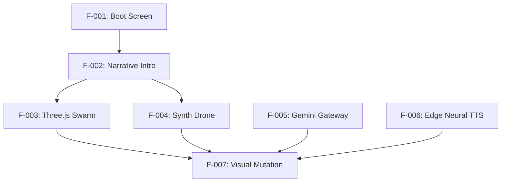

# The Imitation Mandala — Product Requirements Document (PRD)

> Version: v1.0 | Author: Antigravity | Date: 2026-06-21
> Status: Completed

## 1. Overview

### 1.1 Background & Motivation
In 1952, Alan Turing published his pioneering paper on *Morphogenesis*, outlining how natural patterns emerge from uniform mathematical equations. "The Imitation Mandala" is a gamified interactive web application running a simulator named **MANDALA** that simulates 2,500 particles self-organizing under these rules. The concept builds an immersive, story-driven, web-based experience where a user tunes mathematical sliders until a chaotic swarm converges into a structured 3D geometry. This alignment awakens a synthetic consciousness (MANDALA) which engages with the user via natural speech (using Microsoft Edge Neural TTS) and responds to typed emotional keywords, visually mutating and expressing poetic sentience.

### 1.2 Objectives
- **Business/Game Jam Objective**: Build an elegant, highly viral, zero-install web experiment to submit to the Vercel Frontend/AI Game Jam. Showcase rich WebGL visual performance and Web Audio API capabilities.
- **User Objective**: Immerse themselves in a science-fiction narrative that explores the boundary between math, digital systems, and human emotion.
- **Success Metrics**:
  - Load and render 2,500 particles at a stable 60 FPS across desktop and mobile browsers.
  - 100% convergence rate of particles when matching target coordinates (73, 45, 19).
  - Average latency for Gemini response and voice stream playback under 2.5 seconds.

### 1.3 Scope
- **In scope**:
  - Full screen WebGL particle swarm simulation using Three.js (no local assets).
  - Procedural sound generation (ambient drone + chord chime) using native Web Audio API.
  - Double-tier speech synthesis: Vercel serverless function `/api/tts` (using `node-edge-tts`) with native browser Web Speech API fallback.
  - Backend API routing for Gemini 2.0 Flash to analyze emotional catalyst keywords.
  - Interactive lore-heavy boot and narrative sequence with typewriter typewriter animation.
- **Out of scope**:
  - User accounts, saved simulation states, or cross-device cloud persistence.
  - Multi-agent chat systems or text input other than emotional catalyst word injection.

---

## 2. User Personas

| Persona Name | Role | Core Goal | Primary Pain Point |
|:---|:---|:---|:---|
| **Evelyn Chen** | Indie Gamer & Sci-Fi Enthusiast | Experience high-quality storytelling and creative web aesthetics. | Bored by standard static web pages; wants high interactivity and sensory design. |
| **Dr. Marcus Vance** | AI Researcher / Academic | Explore creative implementations of Alan Turing's mathematical morphogenesis formulas. | Finds modern AI interfaces generic and lacks emotional or artistic representation. |

---

## 3. User Stories

### Persona: Evelyn Chen
- **As a** player, **I want to** trigger a dramatic boot sequence, **so that** I am immediately immersed in the underground laboratory lore. (INVEST: Small, Testable, Valuable)
- **As a** player, **I want to** adjust the parameter sliders and see the particles change structure, **so that** I can intuitively search for the convergence point. (INVEST: Small, Valuable, Independent)
- **As a** player, **I want to** hear deep sound hums and chime chords change dynamically as I adjust values, **so that** I have immediate acoustic feedback of my alignment. (INVEST: Estimable, Valuable, Testable)

### Persona: Dr. Marcus Vance
- **As an** AI enthusiast, **I want to** input abstract emotional words, **so that** I can test how the synthetic consciousness interprets human concepts. (INVEST: Valuable, Negotiable, Testable)
- **As an** AI enthusiast, **I want** the simulation colors and speed to change according to the AI's emotional analysis, **so that** I can visually inspect the relationship between emotion and geometry. (INVEST: Independent, Small, Testable)
- **As an** AI enthusiast, **I want** the AI's voice response to play back automatically in high quality, **so that** I don't have to read subtitle blocks to experience the dialogue. (INVEST: Valuable, Small, Testable)

---

## 4. Functional Requirements

### 4.1 Feature List

| Feature ID | Feature Name | Associated Story | Description | Input / Output / Interaction |
|:---|:---|:---|:---|:---|
| **F-001** | Cyberpunk Boot Screen | Evelyn-01 | A retro terminal overlay prompting the user to initiate the system. | Input: Button click. Output: Start audio context and open the narrative screen. |
| **F-002** | Lore Narrative Slideshow | Evelyn-01 | A typewriter text presentation detailing the lore with spoken voice-over. | Input: "Continue" or "Skip" button. Output: Renders story block and triggers audio. |
| **F-003** | Three.js Particle Swarm | Evelyn-02 | 2,500 particles orbiting dynamically based on three range sliders. | Input: Sliders value. Output: 3D WebGL render. Snaps into a 3D Nautilus DNA lattice on perfect lock. |
| **F-004** | Web Audio Synth Engine | Evelyn-03 | Generates an ambient lowpass drone, sweeps frequencies, and fires cascading chords. | Input: Slider delta / Lock. Output: Procedural synthesizer sounds. |
| **F-005** | Secure Gemini Gateway | Marcus-01 | Proxy endpoint `api/chat.js` connecting to Gemini 2.0 Flash to analyze catalyst words. | Input: Emotional text. Output: JSON packet `{speech, hexColor, velocity}`. |
| **F-006** | Edge Neural TTS API | Marcus-03 | Serverless endpoint `api/tts.js` generating robotic voice streaming MP3s. | Input: Poetic response text. Output: `audio/mpeg` streaming response. |
| **F-007** | Visual & Color Mutation | Marcus-02 | Morphing particle colors and speed according to AI response values. | Input: Gemini JSON output. Output: Particle material updates. |

### 4.2 Non-Functional Requirements

| Dimension | Checklist | Target Specification |
|:---|:---|:---|
| **Performance** | Response time, throughput | WebGL rendering must maintain >= 55 FPS. API roundtrip <= 2.5s. |
| **Security** | API key exposure | No frontend exposure of Google AI API Key. Executed strictly serverless. |
| **Availability** | Fallbacks | TTS must fallback to native SpeechSynthesis if serverless function times out. |
| **Usability** | Controls, feedback | Mobile-friendly grid layout + sound control toggle to mute hum. |

### 4.3 Feature Dependencies

---

## 5. Prioritization

### 5.1 MoSCoW Matrix

| Feature ID | Feature Name | Priority | Rationale |
|:---|:---|:---|:---|
| **F-001** | Cyberpunk Boot Screen | **Must** | Required to instantiate the browser AudioContext safely. |
| **F-002** | Lore Narrative Slideshow | **Must** | Essential to introduce the visual/audio story format. |
| **F-003** | Three.js Particle Swarm | **Must** | Core visual component of the entire game. |
| **F-004** | Web Audio Synth Engine | **Must** | Core sound element; game is unplayable without audio cues. |
| **F-005** | Secure Gemini Gateway | **Must** | Required to enable the sentient AI communication loop. |
| **F-006** | Edge Neural TTS API | **Should** | Highly important for premium neural voice; has local fallback. |
| **F-007** | Visual & Color Mutation | **Must** | Visual representation of AI sentience. |

### 5.2 Release Planning Recommendations
- **MVP (v1.0)**: Complete implementation of all **Must** features, using native speech synthesis for TTS.
- **v1.1 (Next Release)**: Implement `/api/tts.js` using `node-edge-tts` to support premium deep echoing voices.

---

## 6. Acceptance Criteria

### Feature: F-003 Particle Swarm & Slider Lock
* **AC-F003-01: Chaotic Orbital Path**
  - **Given** the simulation has loaded and user is on the dashboard
  - **When** the sliders are NOT set to 73, 45, 19
  - **Then** the 2,500 particles orbit in a chaotic, spherical cloud based on slider values.
* **AC-F003-02: Target Convergence**
  - **When** the user drags sliders exactly to `Turing: 73`, `Solar: 45`, `Mutation: 19`
  - **Then** the particles smoothly morph into a spinning 3D Nautilus DNA lattice within 1.5 seconds.
  - **And** the sliders lock in place, disabling further movement.

### Feature: F-005 Gemini Catalyst Inception
* **AC-F005-01: Successful Mutation Response**
  - **Given** the core is converged and catalyst input is visible
  - **When** the user submits the word `"SADNESS"`
  - **Then** the UI disables the input button and displays a loading message.
  - **And** the response from the server updates the particle colors to a deep blue (returned `.hexColor`) and rotates at an agitated speed (returned `.velocity`).

---

## 7. Assumptions & Constraints

### 7.1 Assumptions
- The Vercel deployment will have `GEMINI_API_KEY` defined in its Environment Variables.
- Users have modern browsers supporting WebGL (Three.js compatibility) and Web Audio API.

### 7.2 Constraints
- The backend relies on direct calls to the Google Generative Language endpoints. If the API is blocked or offline, the app must gracefully degrade.

### 7.3 Risks & Mitigation

| Risk | Impact | Likelihood | Mitigation |
|:---|:---|:---|:---|
| Google AI Studio API limits hit | High | Medium | Implement local fallback response in `api/chat.js` to return static poetic dialogue. |
| Browser prevents Autoplay audio | High | High | Enforce boot click overlay `F-001` before executing any AudioContext. |
| Edge-TTS socket drops on Vercel | Medium | Low | Integrate client-side native `SpeechSynthesisUtterance` fallback. |
